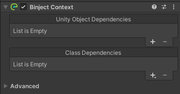
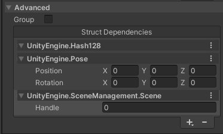
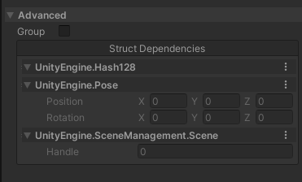

# Binject 
### Better Dependency Injection System for Unity. 

## ✨ What is Binject and Why use it?
Binject is a dependency injection system for Unity. It's a simple and easy to use DI system that allows you to easily inject any type of dependencies into MonoBehaviours. It's advantages to other DI systems are:
- It's intuitive and little learning curve.
- It's more performant and lightweight.
- Supports all types as dependencies.

Your work as a developer will essentially be much easier once you use this in your games. Imagine not having to drag and drop a component for each consumer every time. Imagine not having to initialize fields of Instantiated objects one by one. 

## ⚒️ Installation
### UPM
You can install this as a unity package by following the instructions at [the official manual](https://docs.unity3d.com/Manual/upm-ui-giturl.html). 
> The package url is `https://github.com/somedeveloper00/Binject.git`
### Git Submodule
clone the repository into your project's Assets/Plugins folder as a submodule:
```bash
git submodule add --force https://github.com/somedeveloper00/Binject/Assets/Plugins/Binject
git submodule update Assets/Plugins/Binject
```
or if you don't have git, simply download the zip and extract it into your project's Assets/Plugins folder:
> Linux / MacOS
> ```
> wget https://github.com/somedeveloper00/Binject/archive/refs/heads/main.zip -O Binject.zip
> unzip Binject.zip -d Assets/Plugins
> rm UnityTodo.zip

> Windows
> ```
> mkdir Assets\Plugins
> curl -L -o UnityTodo.zip https://github.com/somedeveloper00/Binject/archive/main.zip
> tar -xf Binject.zip -C Assets/Plugins
> del UnityTodo.zip
> ```

## ✒️ Example Code:
### Injection
```csharp
public class Movement : MonoBehaviour {
    Rigidbody _rigidbody;
    GroundedCheck _groundedCheck;
    Living _living;
    public void Awake() => this.GetDependency(out _living, out _groundedCheck, out _rigidbody);
}
```
### Binding
```csharp
var context = this.FindNearestContext();
context.Bind( _rigidBody );
```

## 📋Technical Notes
* You can use Binject just fine in both **editor** and **runtime**.
* Binject works better in build than in inspector, because it sometimes has to do extra work in inspector to keep the inspector up to date, if you have a `Binject Context` component open in inspector.
* There have been hours and days of research dedicated to **minimize garbage allocation**, and as the result, Binject allocates no garbage for dealing with value types, and minimum garbage when dealing with reference types. The performance is enough to do **thousands** of injections in a single frame without any performance drop.

## 💡Usage
### Contexts (Binject Context or BContext)
There are `Binject Context` components that you can add to your scenes, these are the entry points for dependencies to inject from.  
   

The list **Unity Object Dependencies** is used for Unity Objects (derived from `UnityEngine.Object`) and the list **Class Dependencies** is used for any other serializable class. That the dependencies can be from any assembly, so long as they are publicly available and serializable.  

> _**Advanced:**_  
> Under the advanced menus in a `Binject Context` component, you can use value types (structs) as dependencies. You can add value type dependencies right from inspector. But be careful, any value type added from inspector will be boxed and unboxed every time it's used. So it's recommended to add value type dependencies from code.  
>   
> This list is also useful for debugging the value typed dependencies at runtime; you can inspect and browse the values of the dependencies that are added from either inspector or code, but you won't be able to edit them.  
>   
> The advantage of value typed dependencies is it's performance and that it **allocates no garbage** whatsoever. Which, as explained above, is not the case for value typed dependencies added from inspector. The performance for value typed dependencies added from code is well above 5 times better than reference typed dependencies, and you can easily inject up to above 2000 of them in every frame under 1.5 milliseconds.


### Injection

There are various ways you can inject a dependency, and all of them are done solely by the consumer (you); nothing is automated because that would be less performant. Here's the thing with this library: **the priority number one is always performance**. While the consumer has to do one or two calls, the performance is much better than other DI systems. You can easily ask for an injection in any `MonoBehaviour` code by the following syntax:  
```csharp
value = this.GetDependency<DependencyType>();
```
If you have multiple dependencies, you can use another syntax that retrieves multiple dependencies in a single call:
```csharp
this.GetDependency(out value1, out value2, out value3);
```
Another way to inject dependencies is through using a `BContext` reference; if you have a `BContext` object called `context`, you can inject dependencies from it like this:
```csharp
if (context.HasDependency<DependencyType>()) {
    value = context.GetDependencyNoCheck<DependencyType>();
}
```
Or in a single call:
```csharp
value = context.GetDependency<DependencyType>();
```
You can skip `HasDependency` check if you're sure that the dependency exists in the context. That will be faster.
You can't use the multi-injection syntax by using `BContext` directly. It's worth noting that using a `BContext` directly is generally more performant, but it'll take away the ability to let the Binject system decide what context to give to you; Which you can always do so by:
```csharp
context = this.FindContext<DependencyType>();
```
which will give you the context that contains that type, using performant internal search methods. Or if you just want to get the context that is nearest to your component, you can do
```csharp
context = this.FindNearestContext();
```
> _**Advanced:**_  
> Contexts support grouping by number; you can assign group numbers to contexts to then retrieve them by number. Useful when transform hierarchy is not enough to determine the dependency. (i.e., finding player for UI)  
>   
> To use a group number for injection, you can use the following syntax:
> ```csharp
> value = this.GetDependency<DependencyType>( groupNumber );
> ```
> Same for any other injection functions. (i.e., `FindContext`, `FindNearestContext`, etc.)

### Binding
You can bind dependencies to a context either from inspector or by code using the following syntax:
```csharp
context.Bind( dependency );
```
And you can unbind the dependency using:
```csharp
context.Unbind( dependency );
```

### More About Context Search
Internally, contexts are searched by different factors and priorities; it's good to know them. The search is done in the following pseudocode:
1. ✅ If self or a parent has context with given type and given group number, return it.
2. ✅ If scene root Context has given type and given group number, return it.
3. ✅ If topmost scene root Context has given type and given group number, return it.
4. ✅ If any context has given type and given group number, return it.
5. ❌ Give up.

> _**Advanced:**_  
> A **scene root Context** is a context that sits on the top-most level of the hierarchy, compared to other contexts within the scene.  
> A **topmost scene root Context** is a scene root Context that belongs to the topmost scene in the hierarchy.

## 🤝 Contribute
Feel free to open issues and pull requests. There are no strict rules for contributing, but please try to follow the coding style of the project. If you want to contact me, you can find my email in my profile.

## 🙌 Support
If you like my work, you can buy me a coffee to keep me motivated to work on this project and other projects like this.
My wallet addresses are:
* BTC: `bc1q808ykgvhn2ewtx09n3kdhnlmcnc6xqwxa0hnys`
* ETH: `0xCe7028266Cf3eF0E63437d0604511e30f8e4B4Af`
* LTC: `ltc1qlu2jahcdr5kqf5dp9xt3zr3cv66gm2p8hmnz9j`

## 📝 License
This project is licensed under the MIT License - see the [LICENSE](LICENSE) file for details.
